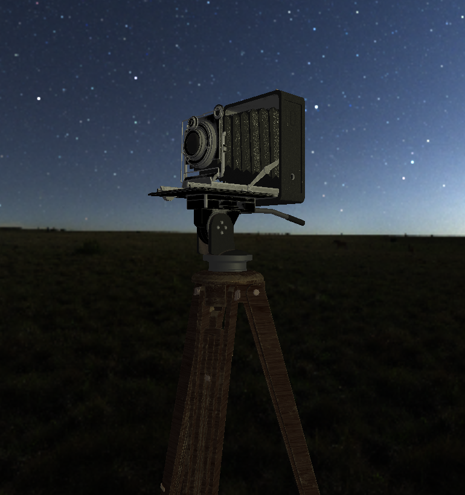

# DX12Learning

A project to learn DirectX12 and help other people learn DirectX12 in the process.

The project is divided into demos to separate chapters in the learning process.

It is a project made by a student as homework during his studies, you may want a real tutorial but it may come as a good way to start.

Here is an example of the result of the last demo:

## Table of Contents

- [DX12Learning](#dx12learning)
    - [Table of Contents](#table-of-contents)
    - [Techs](#techs)
    - [How to Build](#how-to-build)
    - [How to Run](#how-to-run)
    - [Additionnal Notes](#additionnal-notes)
    - [License](#license)

## Techs

Here is a list of the techs used in this project:
 - GLFW for the window manager
 - ImGUI (for dx12) for simple UI
 - GPM (a math library made by one of my collegue in the [GPEngine](https://github.com/GP-Engine-team/GP_Engine) project)
 - tiny_gltf for model loading which itself depends on:
    - stb_image for image loading
    - json.hpp for model parsing
 - the CMake solution given by VisualStudio 2019 with clang-cl for windows and Ninja to build(see CMakeSettings.json)
 - d3dx12.hpp and DDSTextureLoader12 for faster setup

## How to Build

The project has been compiled using the support of Visual Studio for CMake mainly with Ninja, and clang-cl on windows, I guarantee at least that it will compile using this method.

The CMakeSettings.json is available to you. you may change the compiler and the generator if you do not want to use clang and Ninja.

So steps are:
 - Install the CMake support for VisualStudio 2019
 - Open the folder containing the project with VisualStudio 2019
 - Visual should recognize the CMakeSettings.jso file and will open the CMake prompt
 - you may close it and choose a debug target
 - then click on it to build (or go in Build/Rebuild All)

## How to Run

After building, the executable should be in the bin folder, in a folder named from the setting name of your CMakeSettings DebugTarget. its name is DX12Learning.exe.

No pre-compiled executable are given with the project, so, you must build theproject yourself.
See [How to Build](#how-to-build) to have some tips and advice on how to build the project. 

## Additionnal Notes

- The demos have been designed the simplest as possible making that most things are hardcoded. All that is being done with DirectX12 is correct nevertheless, wich was the whole point.
- I am aware of the UI bug that makes that you cannot rotate on x and that if you do, all the other fields become buggy. It comes from the fact that GPM was originally designed for openGL, and I was not able to find a fix to the problem during the time making. Just don't touch it. Or fix it, your call.
- Scale resets rotation, must come from the same problem. Once Again, do as you wish but I won't fix it.

## License

See the License.md file for license rights and limitations.

License of the actual code would be the Unlicensed. However the [AntiqueCamera](https://github.com/KhronosGroup/glTF-Sample-Models/tree/master/2.0/AntiqueCamera) model comes from the [GLTFSample](https://github.com/KhronosGroup/glTF-Sample-Models) repository, for this see the licensing of the repo.

# DirectX12 Tutorial

